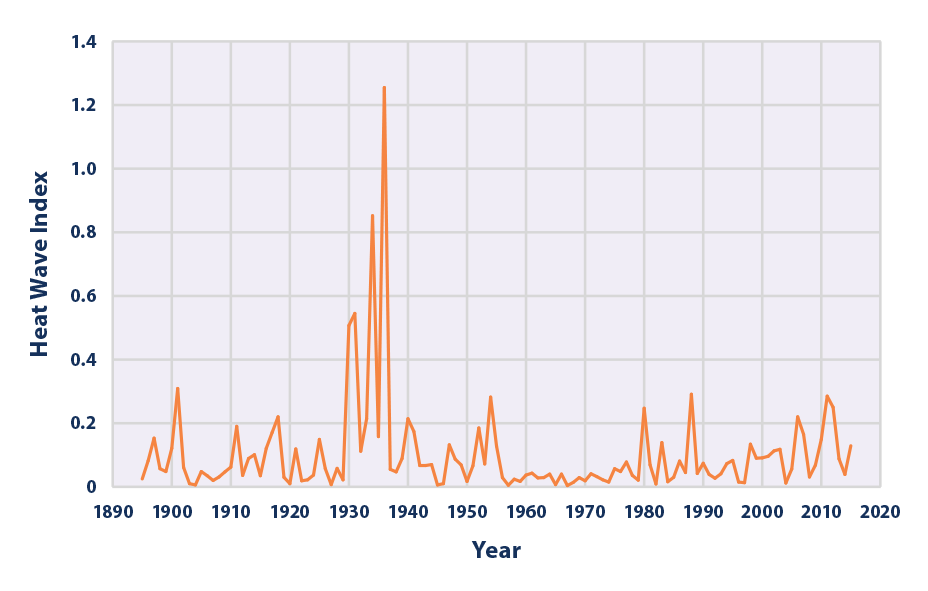

# Climate Change: Analysis and Simple Model for days above 90 Degrees Fareinheight

## My Question:

Is it possible to predict how many days in a given year will be above 90 degrees? Using the features total precipitation, and the average atomsopheric CO2 content.

When meeting someone new, many people instinctively mention the weather,'Boy it sure is hot today!' or 'Dang it took my car fifteen minutes to warm up in this artic tundra we call Colorado.'. It makes sense for people to bring up the weather often, as we are living inside of it -but the weather always seems to be changing! 

## My Data and Methods:
NOAA CO2: 
ftp://aftp.cmdl.noaa.gov/products/trends/co2/co2_mm_mlo.txt

Division of Atmospheric Research, CSIRO CO2 Data: 
[CSIRO CO2 Data](https://cdiac.ess-dive.lbl.gov/ftp/trends/co2/lawdome.combined.dat)

NOAA United States Historical Climatology Network (USHCN) Station Data:
ftp://ftp.ncdc.noaa.gov/pub/data/ghcn/daily/

NOAA Station Readme:
ftp://ftp.ncdc.noaa.gov/pub/data/ghcn/daily/readme.txt

After downloading the full station datasets I isolated all of the stations in Minnesota, and then averaged the number of days above 90 degrees Farenheit and total precipitation for every year. Some of the stations go as far back as 1880 where-as others only go back as far as the early 1900's. Because of this I decided to choose my starting year as 1918 and my finishing year as 2018, providing a century worth of data. 

As with most datasets there were some unrecorded values. The way I handled this was to assume that any day the temperature was not recorded was below 90 degrees. I think this is a fair way of doing it as the missing values are spread among different seasons.

## Exploratory Data Analysis

Lots of interesting plots below. One of the most fascinating is the CO2/Year plot. After 1950 it starts to grow exponentially. My theory is 1950 was a time of great growth for the transportation industries. Also in the late 1960's, Brazil started ramping up their deforestation efforts. In 1955 the first automobile companies sold over 6 million units in one year and by the end of the 50's commercial airlines were becoming more and more streamlined - yet another contributer to the growth of CO2 in our atmosphere.

I found a paper published by David Hofmann who works at the NOAA lab in Boulder, CO. Hoffman's paper shows a very strong relationship between CO2 emissions and world population, which intuitvely makes lots of sense.

[Hoffman's Paper](https://www.google.com/url?sa=t&rct=j&q=&esrc=s&source=web&cd=1&cad=rja&uact=8&ved=2ahUKEwjouuH2krzgAhWJrFQKHZilAm8QFjAAegQIChAC&url=https%3A%2F%2Fams.confex.com%2Fams%2Fpdfpapers%2F144105.pdf&usg=AOvVaw1Qgv2cLAc_YmQHCkt6mfOm)

Another interesting plot is the Days Above 90 vs Year

This plot is fasicnating because its the opposite of what I expected to see. As the years go by, the number of hot days seems to be decreasing. At first I believed that perhaps I had done something wrong in my analysis, but after looking around online I found a plot from the National Climate Assessment, Climate Science Special Report, which shows the same trend as my analysis. Knowing now that my analysis was correct, I dug a little deeper into the 1930's and the very high data point in 1988. During the 1930's the US had severe drought commonly referred to as "The Dustbowl." Because of this drought, there was minimal evaporative cooling leading to higher temperatures. The same is true for 1988, known as the "North American Drought" and commonly referred to as the worst drought since "The Dustbowl." This drought was so severe that Minnesota reached 110 degrees, and the entire Mississippi River almost dried up.

## LinearModel

Using the heatmap we can see some weak correlations between the features and the target. Upon reviewing the pairplot we could also see some potential collinearity. Because of this I calculated a variance inflation factor on the model, which returned me:

Year: 265.0760594003911,	

Daysabove90: 5.154538218062721	

Total_precip: 82.11377868858722 	

Average CO2: 194.31840401673068

According to the VIF I have a gigantic issue with collinearity. Because of this issue I ran a KFold test to determine my most effective features. The overall best feature turned out to be Total Precipitation which had roughly twice the r-squared values of the other features.

Total Precipitation makes the most sense to be our feature as well if it rains/snows more in a year it is logical to assume that there will be less hot days.

Now that I've determined my feature I created the actual model:
                         

| | coef    	| std  err 	| t      	| P>t 	| .025  	|.975| adj r-squared|
|--------------|---------:|----------:|--------:|-------:|--------:|--------:|-----:|
| const        	| 37.7222 	| 7.234    	| 5.214  	| 0.000 	| 23.368 	| 52.076 	| 0.286|
| total_precip 	| -0.0401  	| 0.006   	| -6.404	| 0.000 	| -0.053  	| -0.028	

With an adjusted R-squared of .286 we can safely say my model is not a great way of predicting future counts of high temperature days. Which in a way makes sense, climate is a very complex system which should require more than 1 feature to model.

